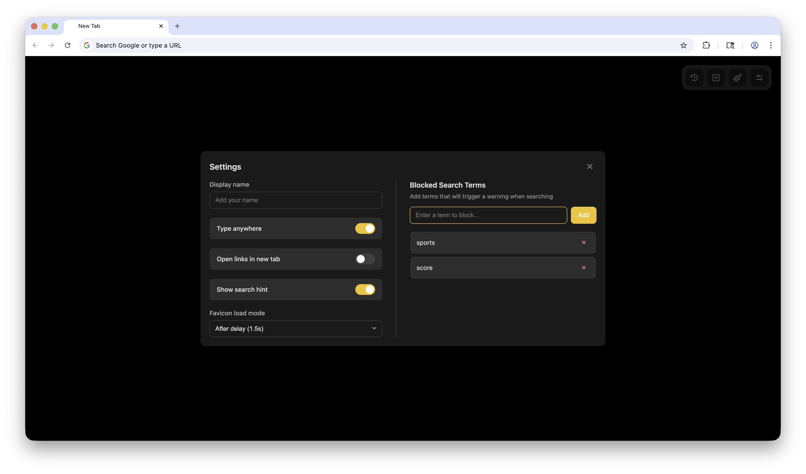

# Tabstract

## About

Tabstract is a highly customizable, beautiful, and feature-rich new tab page for Chromium based browsers (Google Chrome, Microsoft Edge, Arc, etc).

## Screenshots




## Features

Tabstract has many features to explore.

### Greeting and clock

When you open a new tab, you'll see a clock and a greeting (sometimes present, sometimes funny, and sometimes even a bit snarky). The greeting adapts to the time of day. If you set your name in the settings, then the greeting will also include your name. The clock will show the current time in 12-hour format.

### The Search Bar

#### Searching

The search bar is the primary element of the new tab page. Simply click into the search bar, type a query, and press enter. You can also press command + enter to open a tab with ChatGPT. The query will autofill in the prompt box, but you will have to manually press enter due to restrictions of the ChatGPT UI.


#### Search Filters

Tabstract has several baked in features to help you find what you're looking for even faster. To use a search filter, either type `/` then use the arrow keys and enter to select the filter you want, or click the filter icon and then click the filter you want to use. From there, you can search Google like normal. Here are the available filters:

##### Last hour

This filter will search the web for information from within the last hour. This can be useful for finding the most up to date information on a current event.

##### Past day

Similar to the previous filter, this one will only return information from within the past day. This can be useful for up to date information, but with a slightly longer max age so you can find more results.

##### Transparent images

If you've struggled to find the perfect png for your needs before, look no further! This filter only shows images for your search topic with transparent backgrounds.

##### High-res images

If you want images that will still look beautiful even when scaled way up, this is the ideal filter for you.

##### PDFs

Trying to find a full text online? Or maybe you need a specific document, but keep getting useless website links instead. This filter will only search for PDFs that can be clicked on and viewed directly as a PDF.

##### Web results only

As Google adds increasingly more bloat to their search, they've secretly included a special search tool that only shows you links to relevant sites (no AI overviews, no "helpful" highlighted answers, just good old-fashioned links).

##### Clear filter

While not technically a filter, if you want to remove the selected filter from your current search, click this button.

### Quicklinks

Quicklinks are sites you can add and quickly jump to. By default, nothing will show here. Once you add sites (see the section on adding sites later), you can also right-click on them to edit them or delete them, as well as dragging them around to reorder.

### Control island

The control island is present in the top right of the page, and contains several useful items.

#### Saved for later (Counterclockwise clock icon)

The saved for later pane lets you quickly add links to revisit later if you want to have a record of a useful link you found. It also shows how long ago you added it and a handy delete button making it perfect to stay organized with a short list of links you're currently working with. Each saved link item in the list will also inherit the site's favicon and title. You can click the link to visit it. Visiting a link will not remove it, you must hover over it and click the trashcan.

#### Add new link (Plus icon in a box)

The "add new link" functionality will open up a pane to add a title, a url, and pick an icon for the link. By default, when you paste or type the URL, Tabstract will load it's favicon and set it as the icon to display the quicklink with, but if you want a different icon, you can pick from the following list:

- Bookmark icon
- Calendar icon
- Camera icon
- Chart icon
- Message bubble icon
- Envelope icon
- Gear icon
- Globe (Americas hemisphere) icon
- Laptop icon
- Lightbulb icon
- Music note icon
- Pain pallet icon
- Puzzle piece icon
- Rocket ship icon
- Star icon

Once you fill out all three fields, click "Add Link".

#### Theme (paintbrush)

The theming menu offers several controls to make your new tab page feel like your own:

##### Color Scheme

Here you can pick from a light base, a dark base, or have Tabstract switch automatically

##### Accent Color

You can pick from a few different colors to use as the interaction and greeting/ clock text color. Make sure the accent color of the text doesn't conflict with your chosen background.

##### Background image clarity

Here you have a slider you can use to set the transparency of the background image. I recommend leaving it around 15% to 25%, but you can tweak it as you want. 100% will show the image normally, whereas 0% will make it almost completely faded (but it will still stay slightly visible).

##### Background image

Here you can select a background image. I've included an option for no background image, as well as plain white or black, and a small collection of visually appealing paintings.

#### Settings (sliders icon)

##### Display name

Here you can set the name Tabstract will call you by in the greeting, or leave it blank and the greeting will adapt to not include your name.

##### Type anywhere

When on, this setting will automatically focus the search bar when you click onto the page, even if it's not in the search bar. Helpful to make you have to click less.

##### Open links in a new tab

If you want the new tab page to act more as a "router" that spawns new tabs instead of searching in the current tab, turn this on. However, I recommend leaving it off.

##### Show search hint

This shows the message about enter or command enter to search google and chatgpt respectively. This message will always disappear once you start typing, but if you don't want to see it every time the page loads, then turn it off.

##### Favicon load mode

When adding quicklinks, you might want to control how fast the URL's favicon loads in. You can select from:

1. Immediately: tries to load the favicon as soon as any text is typed (not recommended)
2. After delay (1.5s): tries to load the favicon after you stop typing or paste (recommended)
3. After pressing enter: only loads the favicon once the URL box is unfocused (not recommended)

##### Blocked Search Terms

Here you can type strings that, if are in the search term will show a warning before searching. This isn't a hard and fast "safe search" feature. I only put it here so I see a warning before searching Google for a sport team's scores so I don't inadvertently spoil it for myself. When the warning shows, you have the choice to cancel the search or search anyways.

## Installation

Getting started with Tabstract is easy! Since I haven't published this extension yet, you'll have to install it manually. These instructions are written specifically for Google Chrome on a Mac, but other chromium based browsers and operating systems should  work very similarly. To install, please follow these instructions:

### 0. Find a place to save

You should find a place to save the code where it won't be disturbed. Moving it from here will confuse Chrome. As such, I recommend creating a folder for extensions in a safe place such as:

Your home folder: `~/Extensions` or your documents folder: `~/Documents`. Once you pick a place, open the folder in a new terminal window.

### 1. Clone the repo

```bash
git clone https://github.com/geckoHex/Tabstract.git
```

### 2. Enable developer mode

Open your Chromium based browser, and navigate to `chrome://extensions/`. In the top right, click the toggle ON for "Developer Mode"

### 3. Install the extension

In the top left of the page, click "Load Unpacked". Then use the file manager window that's opened to find the extension folder. Click the folder, then click "Select".

### 4. Setup the new tab page

Open a new tab. You will se a popup telling you the new tab page was changed. Click "Keep It". At the bottom of the screen, you will see a bar that says "Tabstract" and a button that says "Customize Chrome". Right click on any empty part of the bottom bar, then click "Hide footer on new tab page".

You're now fully up and running. I recommend opening the themes menu (Paintbrush Icon) and playing around there to get started.

## Issues & Contributing

If you find an issue, please open an issue. Also feel free to fork and edit the code how you want. You can even submit a PR if you're so inclined :)

## Compatibility

This extension has been verified to work on Chrome 141.0.7390.123. Other versions should work fine as well!